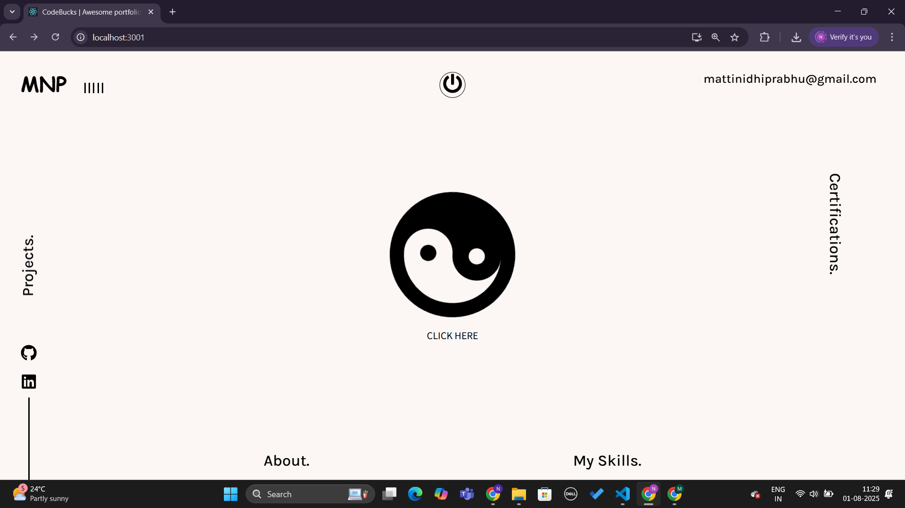
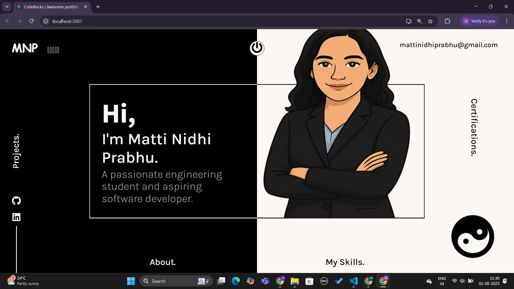
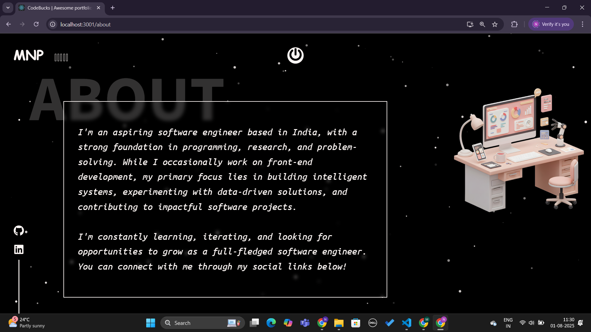
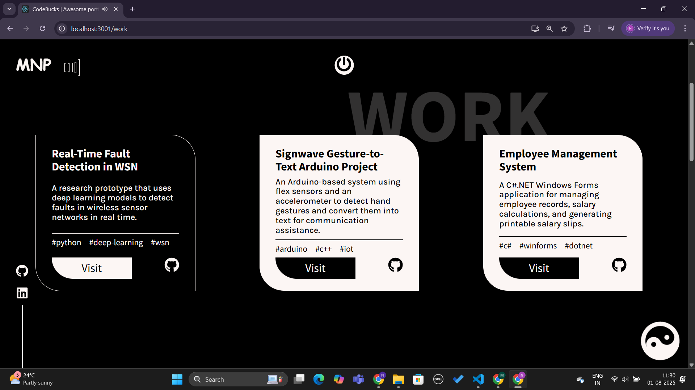
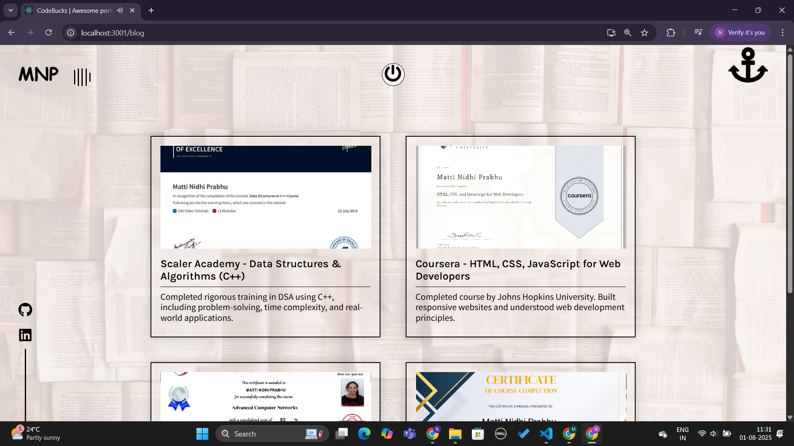
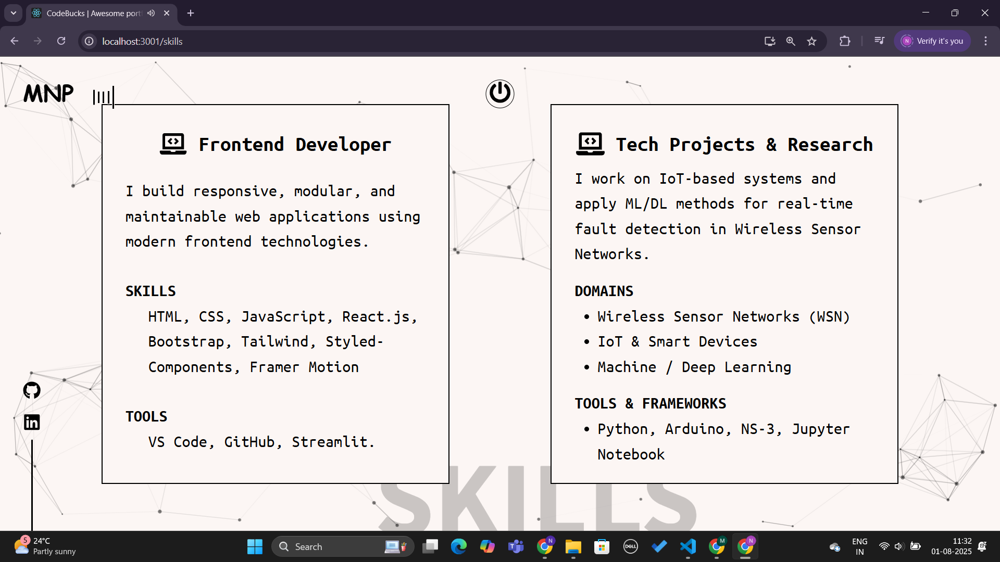

A modern, responsive personal portfolio website built using React.js, showcasing my projects, skills, blogs, and certifications. Designed with animations using Framer Motion, reusable components, and a clean layout, the site includes interactive elements like a clickable YinYang icon, dynamic routing, and smooth scroll effects. Styled with custom themes and structured for scalability, the portfolio reflects both my frontend skills and creative flair.

